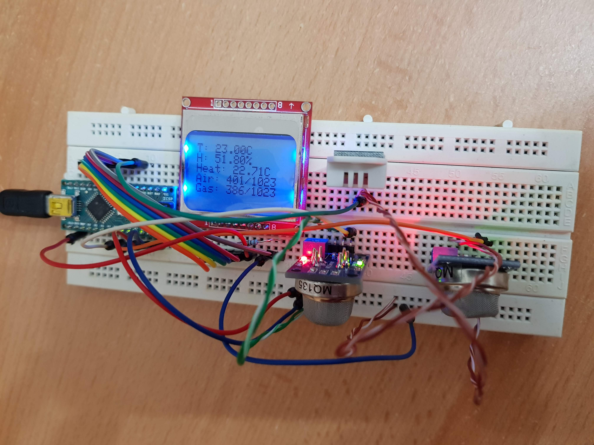
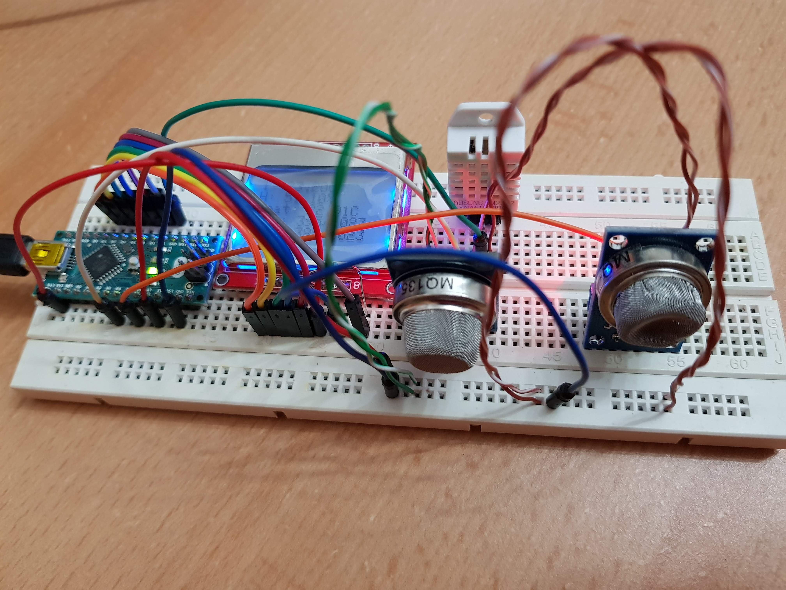

# Air Quality Inspector

Read sensor data about the air's quality display it on an LCD screen.

## Components

* 1x Arduino Nano
* 1x MQ-4 Gas Sensor
* 1x MQ-135 Air Quality Sensor
* 1x DHT22 Temperature and Humidity Sensor
* 1x Nokia5110 LCD Screen
* 1x 290Ohm Resistor

## Connections

TODO

## Photos

* Breadboard prototype
  * 
  * 
