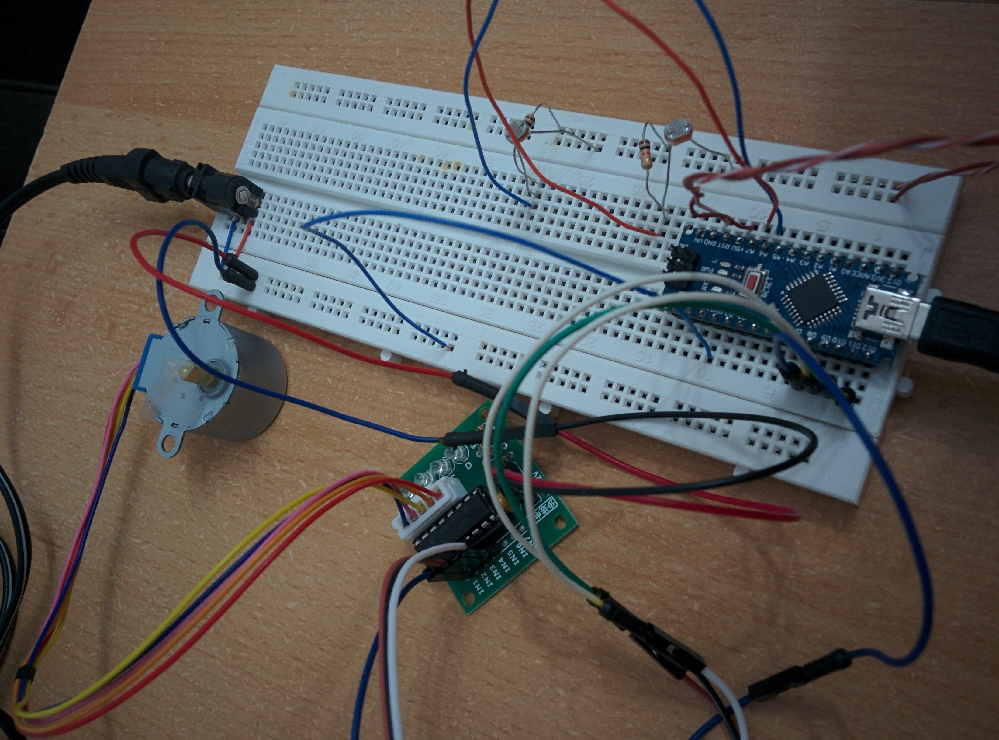

# Automatic Window Blinds Operator

Based on the difference of light intensity between indoors and outdoors, a stepper motor will operate the window blinds.

E.g.: if inside is lighter than outside, the blinds will be closed. If it`s the other way around, they will be opened.

The premise is that a lighter outside environment will reflect light on the windows and the blinds will not necessarily need to be closed, since the interior will not be very visible.

## Components

1x 28BYJ-48 Stepper Motor, 5VDC
1x ULN2003A Stepper Motor Driver
2x Photoresistors
2x 10K Resistors

## Connections

* ULN2003A Stepper Motor Driver
  * `IN1` -> `D8`
  * `IN2` -> `D9`
  * `IN3` -> `D10`
  * `IN4` -> `D11`
  * `+` -> `5V External Power Supply`
  * `-` ->
    * `GND External Power Supply`
    * `GND`
  * `Stepper Connection` -> `28byj-48 Stepper Motor`
* Photoresistor (1)
  * `Leg1` -> `5V`
  * `Leg2` -> `A6`
  * `Leg2` -> `10K R (1)` (voltage divider)
  * `10K R (1)` -> `GND`
* Photoresistor (2)
  * `Leg1` -> `5V`
  * `Leg2` -> `A7`
  * `Leg2` -> `10K R (2)` (voltage divider)
  * `10K R (2)` -> `GND`

## Photo/Video

* Video of the first prototype:
  * 

* Photo of the first prototype from a diferent angle
  * 

