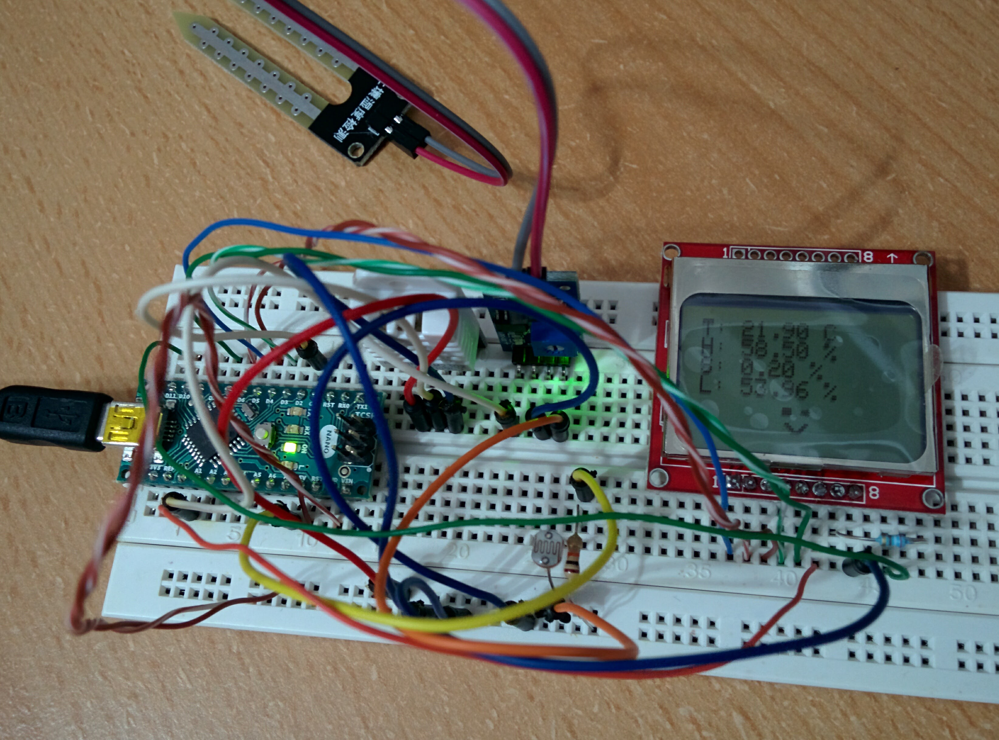

# Plant Monitor

## Components used

* YL69 - Soil Humidity
* DHT22 - Air Temperature and Humidity
* Photoresistor - Ambiental light
* Nokia 5110 LCD - Status display

## Connections

* YL69:
  * `A0` -> `A7`
  * `D0` -> Unused
  * `GND` -> `GND`
  * `VCC` -> `5V`
* DHT22
  * `+` -> `5V`
  * `out` -> `D2`
  * `-` -> `GND`
* Photoresistor
  * `Leg1` -> `5V`
  * `Leg2` -> `A7`
  * `Leg2` -> `10K R` (voltage divider)
  * `10K R` -> `GND`
* Nokia 5110 LCD
  * `RST` -> `D6`
  * `CE` -> `D7`
  * `DC` -> `D5`
  * `DIN` -> `D4`
  * `CLK` -> `D8`
  * `VCC` -> `3V3`
  * `LIGHT` -> `290R` -> `D11`
  * `GND` -> `GND`

## Code

Lost by accident before I got the chance to commit it :).

Can be recreated by mixing the code from each used component.
